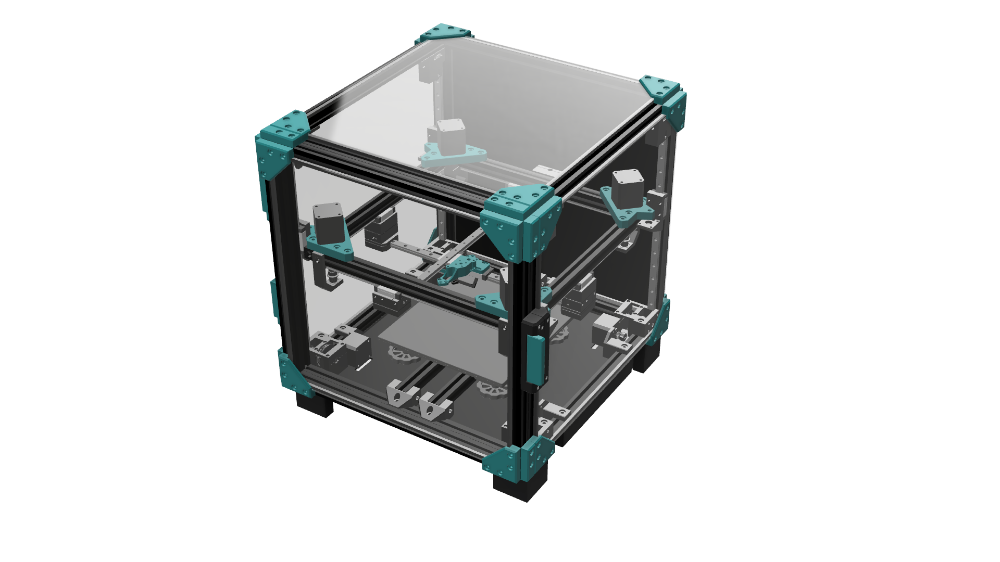

# Slipstream

Slipstream is a high performance cross gantry/flying gantry 3D printer designed with scalability and speed in mind. It can be built as an open-air or fully enclosed printer, using a 2020 aluminum extrusion frame and MGN12H rails/carriages. The toolhead is based on the Annex K3, borrowing the MGN12H adaptation from @Etretti_376690 on Printables and modifying it to fit a Phaetus Rapido/Dragon hotend.

## Specifications
- Cross gantry cartesian kinematics
- Flying gantry (bed is static, gantry moves with Z axis)
- Quad-leveled gantry
- Enclosed or open air
- 2020 frame
- MGN12H rails/carriages
- Annex K3-based toolhead
- NEMA 17 motors for all axes of motion
- 9mm belts for XY motion, 6mm belts for Z
- Reduction pulley drive for Z axis

## Images

